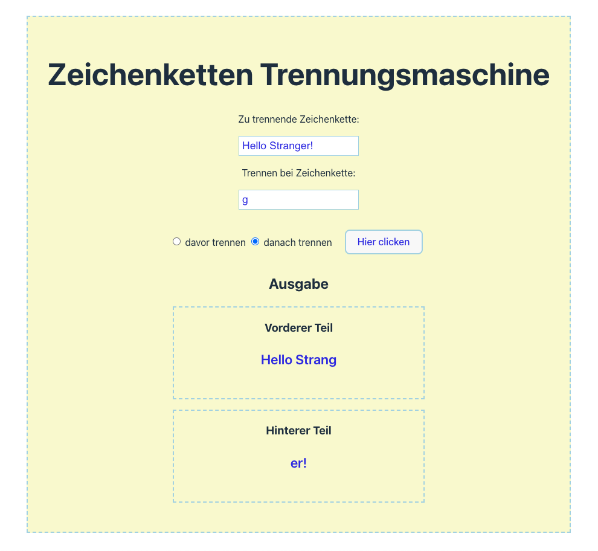

# Project-TS Zeichenketten 🪓trennung

# (String Splitter Form)

## Description

This project allows users to input two strings into a form. The first string will be split into two parts where the second string is found within the first string. The second string can contain multiple characters. Users can specify via radio buttons whether the split should occur before or after the separator string.

## Features

- **String Input**: Enter two strings, where the first string will be split at the point the second string is found.
- **Split Configuration**: Use radio buttons to choose whether the split should occur before or after the separator string.

## Technologies Used

- **TypeScript**: Logic implementation
- **CSS**: Basic styling

## Team

This project was developed by [FranticMario] and [sharonVko].

